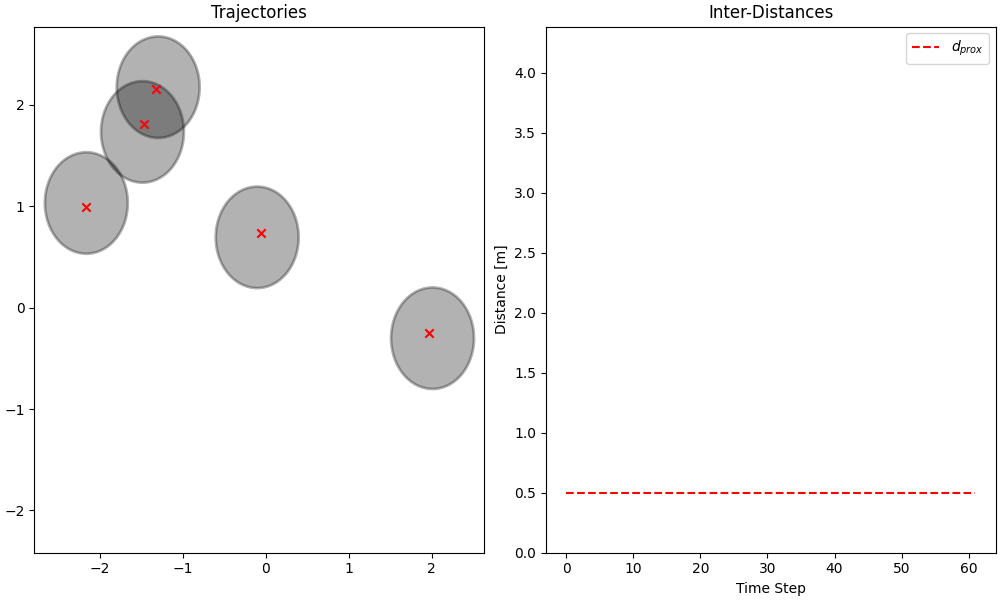

# *Distributed Potential-iterative Linear Quadratic Regulator (DP-iLQR)*

 

## Overview
Repository containing code for a distributed implementation of [Potential
iLQR](https://arxiv.org/pdf/2107.04926.pdf). Putting Potential iLQR into a nutshell, the
ultimate goal is enable cooperative real-time multi-agent navigation by posing the
coupled optimal control problem for each of the agents as a combined decoupled problem
encapsulating the interactions between all agents simultaneously using the concept of a
[potential game](https://en.wikipedia.org/wiki/Potential_game). DP-iLQR is an extension
of this algorithm that improves scalability by splitting up the centralized problem with
all agents into smaller problems with subsets of agents based on their relative
proximities.

The setup that we're most interested in is one in which multiple agents would like to
navigate around each other in a shared space. Each agent starts at some position and
would like to arrive at some goal position or state. Several applications in mobile
robotics include:
- warehouse navigation
- robot/human crowd navigation
- space robotics

The above is one example of what this looks like using 5 unicycle models. Note that while
the dynamics of this scenario are homogeneous, this library currently supports simulation of
non-homogeneous models via zero-padding the states.

## Features
* Simulation and integration of state space models by defining a ordinary differential
  equation and a linearization method in C++. These are the currently implemented models:
  * `DoubleIntDynamics4D`
  * `CarDynamics3D`
  * `UnicycleDynamics4D`
  * `BikeDynamics5D`
  * `HumanDynamics6D`
  * `QuadcopterDynamics6D`
  * `QuadcopterDynamics12D`
* Construction of various cost models including:
  * `ReferenceCost`
    * Penalizes deviations from some reference trajectory
    * $C(x, u) = (x - \bar{x})^\intercal Q (x - \bar{x}) + u^\intercal R u$
  * `ProximityCost`
    * Penalizes the distances $d^{ij}$ between agents $i$ and $j$ below some threshold $d_{\text{prox}}$
    * $C(d^{ij}) = \begin{cases} \beta( d^{ij} - d_{\text{prox}})^2 & d^{ij} < d_{\text{prox}} \\ 0 & \text{otherwise} \end{cases}$
  * `Cost`
    * Any other cost implementing the appropriate methods for the particular problem.
* Potential iLQR solver based on [this
  paper](https://homes.cs.washington.edu/~todorov/papers/TassaIROS12.pdf) by Yuval Tassa
  that incorporates the above dynamical models and cost structures
* DP-iLQR solver that takes advantage of the sparsity of the state space to solve subproblems
  individually. The GIF below visualizes what that might look like for 'agents' in Brownian motion
  where the red is the proximity cost and the grey is the neighborhood that creates the subproblem.
  We see as the agents move around, their interaction graphs are dynamically updated.
  

## Running the Code
To run the code, we assume that you have [dpilqr](dpilqr/) on 
your `PYTHONPATH` environment variable. On unix, this can be accomplished by:

    export PYTHONPATH=${PYTHONPATH}:/absolute/path/to/distrubuted-potential-ilqr/

Additionally, you must compile the C++ extensions using Cython by running:

    python setup.py build_ext --inplace

This should create a `bbdynamicswrap.cpp` as well as a `*.so` file that
`dpilqr` will automatically include in the package namespace.

### Environment
There are a few different python packages that this project relies on listed out in the
next section. One can use the [requirements.txt](requirements.txt) to spin up an
environment with all of the necessary dependencies. To do this, execute the following
(from the top of the repo) (in unix):

    python -m venv env
    source env/bin/activate
    pip install -r requirements.txt

### Organization
- [dpilqr](dpilqr) contains the project source code
- [run/examples.py](run/examples.py) provides several examples that exercise many
  aspects of the library.
- [run/analysis.py](run/analysis.py) contains scripts that run monte-carlo simulations
  to compare Potential-iLQR from DP-iLQR across several parameters.

## Credit
The following two repositories have been instrumental from both an algorithms
and software architecture perspective in the development of this project:
- [HJReachability/ilqgames](https://github.com/HJReachability/ilqgames)
- [anassinator/ilqr](https://github.com/anassinator/ilqr)
